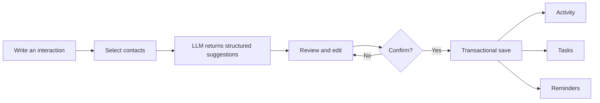

<p align="center">
  
</p>

<h1 align="center">BondMemo · 牵记</h1>

<p align="center">
  <strong>Remember the people who matter.</strong><br>
  互动后快速记录，联系前找回记忆。
</p>

<p align="center">
  <a href="#what-bondmemo-does">Features</a> ·
  <a href="#how-it-works">How it works</a> ·
  <a href="#quick-start">Quick start</a> ·
  <a href="#privacy-and-agent-boundaries">Privacy</a> ·
  <a href="#project-status">Status</a>
</p>

<p align="center">
  
  
  
  
  <a href="LICENSE.md"></a>
</p>

> [!IMPORTANT]
> BondMemo is an early, local-first MVP built on a mature open-source personal relationship management foundation. It is ready for product evaluation and development—not for an unaudited public deployment.

## Why BondMemo

Contact apps remember phone numbers. Social networks remember posts. Neither helps you remember the small, private details that make a relationship feel cared for:

- What did we talk about last time?
- What did I promise to follow up on?
- Is there an important date or open task coming up?
- What context should I recall before reaching out again?

BondMemo turns those scattered details into a private relationship memory. Its first release focuses on two moments where memory matters most: **right after an interaction** and **right before the next one**.

## What BondMemo does

| After an interaction | Before you reconnect |
| --- | --- |
| Write what happened in natural language | Open a brief for one contact |
| Select one or several people | Review recent interactions and open commitments |
| Keep the complete original note | See upcoming reminders and relationship context |
| Review suggested tasks and reminders | Trace every generated point back to a source record |
| Confirm before anything is saved | Use the brief as memory—not as an auto-written message |

### Quick record

Write a plain-text interaction once. BondMemo can suggest a concise summary, tasks, and one-time reminders. Every suggestion stays editable and optional until you confirm it.

### Pre-contact brief

Generate a concise, read-only memory brief from a bounded set of records for one contact: profile details, direct relationships, recent activities and notes, open tasks, and active reminders.

## How it works



The relationship assistant is deliberately constrained:

1. The model receives bounded context, never database access.
2. It returns a fixed JSON structure rather than executable instructions.
3. Laravel validates contact ownership, IDs, dates, field lengths, and item counts again.
4. The user reviews every proposed write.
5. Existing domain services perform the final transactional save.

## Architecture

```text
Blade + Vue 2 interface
        ↓
RelationshipAgentController
        ↓
AnalyzeInteraction / BuildContactBrief / SaveQuickRecord
        ↓
RelationshipAgentClient interface
        ↓
OpenAI-compatible chat-completions provider
```

BondMemo builds on mature contact, relationship, activity, task, reminder, journal, import/export, REST API, CardDAV, and CalDAV foundations. The new assistant remains an isolated application layer; the MVP adds no vector database and no new database tables.

## Privacy and Agent boundaries

BondMemo's assistant is **off by default**.

When enabled, the operator chooses one OpenAI-compatible model endpoint. The model key remains server-side and is never embedded in JavaScript.

For quick record analysis, BondMemo may send:

- selected contact names and IDs;
- interaction date;
- the original interaction text.

For a pre-contact brief, BondMemo may send a bounded selection of:

- basic profile details and direct relationships;
- recent activities and notes;
- open tasks and active reminders.

It does **not** include phone numbers, addresses, photos, documents, or arbitrary unrelated contacts in the assistant context. The assistant cannot automatically edit a contact profile, send a message, or reach out to anyone.

## Quick start

### Requirements

- PHP 8.2+ and Composer
- Node.js 20 and Yarn 1.22
- MySQL/MariaDB
- Redis extension or a compatible Redis setup for the inherited application stack

### Local development

```bash
git clone https://github.com/bleakbelladonnals/bondmemo.git
cd bondmemo

cp .env.example .env
composer install
php artisan key:generate

# Configure your database in .env, then initialize the application.
php artisan setup:test

corepack yarn install --frozen-lockfile
corepack yarn development
php artisan serve
```

The interactive `setup:test` command creates local demonstration data and prints the development login credentials. It is destructive to the configured development database—never point it at data you need to keep.

The inherited installation and operations documentation is available in [`docs/`](docs).

### Enable the relationship assistant

Configure a server-side OpenAI-compatible chat-completions endpoint:

```dotenv
RELATIONSHIP_AGENT_ENABLED=true
RELATIONSHIP_AGENT_ENDPOINT=https://your-provider.example/v1/chat/completions
RELATIONSHIP_AGENT_API_KEY=replace-with-a-local-secret
RELATIONSHIP_AGENT_MODEL=your-model-name
```

Never commit a populated `.env` file. Before hosting BondMemo for other people, publish a privacy policy that names the selected model provider and explains its data handling.

## Verification

The MVP has dedicated PHPUnit coverage for:

- structured interaction analysis;
- multi-contact transactional saves;
- source-linked contact briefs;
- provider configuration and malformed responses;
- document upload restrictions;
- escaped external release notes.

Frontend components pass ESLint and compile through the production Laravel Mix pipeline. See [the project status](#project-status) before treating these checks as a production-readiness claim.

## Project status

### Included in this MVP

- [x] Pure-text quick record
- [x] Multi-contact interactions
- [x] Original text retention
- [x] Editable task and reminder suggestions
- [x] User-confirmed transactional writes
- [x] Source-linked pre-contact briefs
- [x] Server-only provider configuration
- [x] Simplified BondMemo branding and interface
- [x] Upload and release-note security hardening

### Intentionally not included yet

- [ ] Voice or image input
- [ ] Weekly relationship review
- [ ] Message drafting or automatic sending
- [ ] Gift recommendations
- [ ] Diary analysis
- [ ] Natural-language or vector search
- [ ] Autonomous outreach or long-running agent chat
- [ ] Production deployment and real-user metrics

### Known engineering work before production

- upgrade and audit the inherited legacy dependency tree;
- complete a clean Docker build in an unrestricted registry environment;
- validate model quality with a real provider;
- finish public privacy, terms, backup, mail, queue, and monitoring configuration;
- resolve inherited PHP 8.3 test-harness compatibility and external-network tests.

## Security

Do not open public issues containing sensitive vulnerability details. Please follow [`SECURITY.md`](SECURITY.md) for reporting guidance.

The inherited external version check is disabled by default. Document uploads use an explicit allowlist and private storage visibility by default.

## License and attribution

BondMemo is distributed under the GNU Affero General Public License, version 3. Required upstream attribution for the Monica 4.x source foundation is kept in [`NOTICE.md`](NOTICE.md); BondMemo is an independent project and is not affiliated with or endorsed by the upstream project. See [`LICENSE.md`](LICENSE.md) for the complete license terms.

---

<p align="center">
  <strong>BondMemo · Keep the context. Keep the connection.</strong>
</p>
